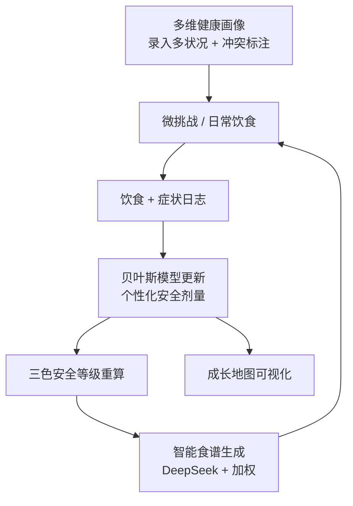

# 吾食（Wushi）产品需求文档（PRD）

> 架构级转向 · 微信小程序 + 真实后端 · 新产品从零定义
> 版本：v1.0（初稿待评审） · 作者：许清楚（产品经理） · 文档状态：评审中
> 关联决策：现有 Vite+React 纯前端 Web 版（归档于 `D:\projects\my\吾食-my diet`）已**冻结**，仅作参考，不并入本 monorepo。

---

## 0. 新项目目录结构建议

**推荐方案：Monorepo（pnpm workspaces）**，前后端同仓。理由：双内核（贝叶斯模型 + DeepSeek 食谱生成）的业务逻辑与前端强耦合、迭代快，共享枚举/常量不易漂移，统一部署到腾讯云更顺。备选方案为前后端分离双仓（适合团队职责清晰、需独立 CI/权限时），此处不展开。

```
wushi/                              # monorepo 根
├── apps/
│   ├── miniprogram/                # Taro + Vue3（微信小程序 + H5 同构）
│   └── api/                        # FastAPI 后端服务
├── packages/
│   └── shared/                     # 前后端共享常量/枚举/类型（安全等级、症状词典、目标权重等）
├── docs/                           # 文档（PRD、架构设计、接口契约）
│   └── prd.md
├── deploy/                         # 腾讯云 SCF / Docker / CI 配置
├── pnpm-workspace.yaml
├── README.md
└── .gitignore
```

**后端 FastAPI 内部结构：**

```
apps/api/
├── app/
│   ├── main.py
│   ├── api/v1/                     # 路由层（auth, profile, challenge, recipe, map）
│   ├── core/                       # 配置、安全、依赖注入
│   ├── models/                     # SQLAlchemy 模型（PostgreSQL）
│   ├── schemas/                    # Pydantic 请求/响应
│   ├── services/
│   │   ├── tolerance/              # 贝叶斯个人耐受模型（Pyro / scikit-learn）
│   │   ├── conflict/               # 矛盾破解引擎（多病交集/并集/冲突标注）
│   │   ├── recipe/                 # DeepSeek V4 Pro 食谱生成层
│   │   └── burden/                 # 组合负担计算（FODMAP / GL）
│   └── db/                         # 连接、迁移（Alembic）
├── tests/
├── pyproject.toml
└── requirements.txt
```

**前端 Taro 内部结构：**

```
apps/miniprogram/
├── src/
│   ├── pages/                      # 首页仪表盘 / 健康画像 / 微挑战 / 食谱 / 成长地图
│   ├── components/                 # 三色徽章、剂量滑块、雷达图等
│   ├── stores/                     # Pinia 状态
│   ├── services/                   # API 封装（调用 /api/v1）
│   └── utils/
├── config/                         # Taro 编译配置（weapp / h5）
├── package.json
└── tsconfig.json
```

---

## 1. 产品目标

### 1.1 一句话价值主张

**吾食是"边吃边学"的个人食物耐受边界学习系统**：帮助用户把多种疾病互相矛盾的饮食禁忌，磨合成一份"能吃什么、能吃多少"的个性化、可量化方案——而不是一刀切的忌口清单。

### 1.2 护城河（差异化）

- **矛盾破解**：对"多病互相冲突"做显式冲突标注与求交集/取并集逻辑，而非静态禁忌库。
- **量化的个人耐受阈值（非二值开关）**：每食物有个性化安全剂量，基于长期饮食/症状日志持续标定。
- **双内核组合**：贝叶斯个人耐受模型（数据驱动学习）+ DeepSeek V4 Pro（自然语言食谱生成），组合使用、缺一不可。
- **微挑战向导**：为"心爱禁忌"食物生成科学的渐进式剂量测试计划，把书里耗时易弃的"控制变量测 limit"自动化。
- **组合负担计算**：单餐 FODMAP 总量、血糖负荷（GL）叠加并主动预警。

> 区别于通用饮食管理 app（如薄荷健康/各类卡路里记录 app）：它们只做热量营养记录或静态禁忌库；吾食的核心是 **personal tolerance learning loop（个人耐受学习闭环）**。

### 1.3 真实痛点 → 功能映射

| 用户真实痛点 | 对应功能模块 |
|---|---|
| 多病矛盾：IBS 忌口的食物，另一些病建议吃 | A2 冲突标注；B6 求交集/取并集逻辑 |
| 界限非绝对：常吃但限量，不是一刀切禁止 | B1 三色等级；B5 个性化安全剂量（非二值）；C4 按阈值 70% 探索性插入 |
| 难割舍的"心爱好食物"（会产气/伤肠胃） | B2 微挑战计划（为 🔴 生成最低剂量起测试） |
| 书里控制变量测 limit 太耗时、易松懈放弃 | B2 微挑战向导自动化；B4 日志驱动贝叶斯更新 |
| 高营养食物易引起血糖剧烈波动 | A1 多状况录入（升糖维度）；B3 组合负担（GL）预警；C1 多目标加权 |
| 未来接外部检测装置 + 按需求（如减脂）生成菜谱 | E 外部设备（规划）；C1 多目标加权（减脂注入） |

---

## 2. 用户故事

### 2.1 核心 Personas

- **小易（IBS + 多病矛盾核心用户）**：28 岁，IBS-D（腹泻型），合并糖耐量异常/备孕等。痛点：IBS 忌高 FODMAP（洋葱、大蒜、豆类），但血糖需要低 GI 高纤维；某些高营养食物升糖快；好食物舍不得丢。诉求：输入所有敏感征 → 看到冲突标注 → 用微挑战测"芒果能吃多少" → 拿到安全食谱。
- **阿减（减脂需求叠加用户）**：有 IBS 基础限制，同时想减脂。诉求：把"减脂"作为权重注入，在肠道稳定前提下拿到精确到克、可替换的减脂食谱。

### 2.2 关键场景 User Stories

- As 多病用户，我希望录入多种健康状况并看到食物冲突标注，以便我不必自己记哪些能吃、哪些矛盾。
- As 多病用户，我希望每食物显示个性化安全剂量（而非"禁止/允许"），以便我能保留高营养食物只是限量吃。
- As 舍不得心爱禁忌的用户，我希望有微挑战计划从最低剂量起分次测试，以便科学地找到自己到底能吃多少（如"芒果 50g 安全，70g 腹胀"）。
- As 减脂用户，我希望把减脂目标作为权重注入食谱生成，以便在不伤肠胃的前提下减脂。
- As 长期用户，我希望有成长地图看到饮食版图从严苛到丰富，以便保持持续磨合的动力。

---

## 3. 需求池（模块 A–F，P0/P1/P2）

> 优先级：P0 = 必须有（MVP）；P1 = 应该有；P2 = 锦上添花 / 远期。

### 模块A 多维健康画像
- **P0 A1** 多状况录入：支持录入多个诊断/状况（IBS 类型、糖尿病、SIBO、组胺不耐等），每项可标注忌口维度（FODMAP 类别 / 升糖 / 组胺等）。
- **P0 A2** 冲突标注：系统对两个及以上状况产生矛盾的食物做显式冲突标记（如"洋葱：IBS 忌口 vs 血糖友好"）。
- **P0 A3** 自定义症状词典：用户可增删症状条目（腹胀/腹痛/肠鸣/排气/腹泻/便秘/反酸等）并设严重度量表。
- **P0 A4** 数据持久化：健康画像存后端 PostgreSQL，随账号同步。
- **P1 A5** 症状严重度量表标准化（0–10 或 1–4 级，统一口径）。
- **P1 A6** 内置食物-症状关联知识库（常见 FODMAP/升糖/组胺食物预设标注，用于冷启动先验）。
- **P2 A7** 外部数据接口预留（CGM/可穿戴）作为画像补充维度。

### 模块B 矛盾破解引擎与微挑战向导
- **P0 B1** 三色安全等级：🟢 超级安全 / 🟡 待探索冲突食物 / 🔴（心爱禁忌），基于画像 + 日志动态计算。
- **P0 B2** 微挑战计划生成：为 🔴 食物从最低安全剂量起、分次小剂量、多次结果收敛生成计划（如芒果 50g → 70g）。
- **P0 B3** 组合负担计算：单餐 FODMAP 总量 + 血糖负荷（GL）叠加，接近用户历史阈值时主动预警。
- **P0 B4** 饮食/症状日志录入：记录每餐食物 + 分量 + 餐后症状，作为贝叶斯模型输入。
- **P1 B5** 贝叶斯耐受模型：基于日志更新每食物个性化安全剂量阈值（Pyro / scikit-learn）。
- **P1 B6** 冲突食物"求交集/取并集"展示逻辑（用户可覆盖）。
- **P2 B7** 自动建议微挑战节奏（基于历史响应时间）。

### 模块C 智能食谱生成
- **P0 C1** 多目标加权：肠道稳定 / 平稳血糖 / 减脂等目标可设权重（如 70/20/10）。
- **P0 C2** 安全种子库：从 🟢 食材抽 majority（默认 70%）食材。
- **P0 C3** 精确到克：食谱给出每食材精确克数。
- **P1 C4** 探索性插入：1–2 种冲突食物按耐受阈值 70% 剂量插入。
- **P1 C5** 一键替换：同等安全等级/营养素替换。
- **P1 C6** 身体状态动态调整：依据近期症状/日志调整食谱（如近期腹泻则降 FODMAP）。
- **P1 C7** DeepSeek V4 Pro 食谱生成层：组合 C1–C6 约束，自然语言生成可执行食谱。
- **P2 C8** 周菜单 / 采购清单生成。

### 模块D 可视化成长地图
- **P0 D1** 个人耐受边界雷达图（各食物类别安全度）。
- **P1 D2** 饮食版图热力图（从严苛基础饮食 → 丰富个性化菜单的时间演化）。
- **P2 D3** 社交/分享（可选）。

### 模块E 外部设备接入（规划）
- **P2 / 规划 E1** CGM 动态血糖仪接口。
- **P2 / 规划 E2** 可穿戴腹围/肠鸣监测。
- **P2 / 规划 E3** 设备数据回流到画像与贝叶斯模型。

### 模块F 账号与后端基础
- **P0 F1** 微信小程序登录（微信开放平台 unionid）。
- **P0 F2** 数据持久化（PostgreSQL）。
- **P0 F3** 隐私合规：健康数据加密存储、隐私政策、用户授权。
- **P1 F4** Redis 缓存/任务队列（食谱生成异步、模型计算）。
- **P1 F5** 后端 API 版本管理 v1。
- **P2 F6** 知识图谱 Neo4j（或初期降级为 JSON 字段）。

---

## 4. UI 设计稿（关键页面）

### 4.1 核心磨合闭环（Mermaid 流程图）



### 4.2 首页仪表盘（ASCII 草图）

```
┌─────────────────────────────┐
│  吾食  👋 小易               │
├─────────────────────────────┤
│  🟢 12   🟡 5   🔴 3        │  ← 三色安全统计
│  今日安全度：良好             │
├─────────────────────────────┤
│  [今日食谱]  [开始微挑战]     │
│  [记录一餐]  [成长地图]       │
├─────────────────────────────┤
│  ⚠️ 预警：午餐 GL 偏高       │
│  🔴 心爱禁忌：芒果(测到50g安全)│
└─────────────────────────────┘
```

### 4.3 健康画像页
- 顶部：多状况 chips（IBS-D / 糖耐量异常 …）+「+ 添加状况」
- 冲突标注区：列出冲突食物及矛盾来源（IBS 忌口 vs 血糖友好）
- 症状词典：列表 + 严重度量表滑块 + 自定义增删

### 4.4 微挑战页（ASCII 草图）

```
微挑战：芒果  🔴 → 🟡
目标：找到你的安全剂量
─────────────────────────
步骤1  50g   [已完成✓ 无不适]
步骤2  70g   [进行中… 记录反应]
步骤3  90g   [待解锁]
─────────────────────────
预计收敛：3 次后给出阈值
```

### 4.5 食谱页
- 目标权重条：肠道稳定 70% ｜ 平稳血糖 20% ｜ 减脂 10%
- 食谱卡片：每食材精确克数 + 安全等级徽章
- 操作：一键替换 / 身体状态调整（今日偏腹泻 → 降 FODMAP）

### 4.6 成长地图页
- 雷达图：各食物类别安全度（蔬菜/水果/蛋白/谷物 …）
- 热力图：时间 × 食物类别 的安全度演化（从红到绿）

---

## 5. MVP 范围界定

### 5.1 第一版必须上线（MVP）
- **形态**：微信小程序（H5 同构可同期或紧随）
- **后端**：FastAPI + PostgreSQL；账号登录（F1）、持久化（F2）、隐私合规（F3）
- **模块A**：A1 / A2 / A3 / A4（多状况、冲突标注、自定义症状、持久化）
- **模块B**：B1 / B2 / B3 / B4 + **B5**（三色、微挑战、组合负担、日志、**贝叶斯模型**——MVP 核心学习内核）
- **模块C**：C1 / C2 / C3 + C4 / C5 / C6 / **C7**（加权、安全库、精确克、探索插入、一键替换、动态调整、**DeepSeek 生成**——双内核缺一不可）
- **模块D**：D1（雷达图）
- **模块F**：F1 / F2 / F3（+ F4 Redis 建议同期，F5 API v1）

### 5.2 依赖标注
- **依赖真实后端**：所有持久化 / 登录 / 日志 / 画像 → 全部 MVP（无后端无法"长期磨合"）
- **依赖贝叶斯模型**：B1 三色计算、B2 微挑战 dosing、B5 阈值标定、C4 探索性剂量 → MVP 必含
- **依赖 DeepSeek V4 Pro**：C7 食谱自然语言生成 → MVP 必含（与贝叶斯组合）
- **知识库先验（冷启动）**：A6 内置食物标注 → MVP 或紧接 MVP（影响冷启动质量）

### 5.3 远期规划（不在 MVP）
- 模块D P2（D2 热力图、D3 分享）
- 模块E 全部（CGM/可穿戴接入 E1–E3）
- 模块C P2（C8 周菜单/采购清单）
- 模块B P2（B7 自动节奏）
- 模块F P2（F6 Neo4j，初期降级 JSON 字段）
- 多端深度同构、社交化、专家/营养师对接

---

## 6. 待确认问题（需用户 / 架构师拍板）

1. **贝叶斯冷启动**：用户初期无日志，安全剂量如何初始化？（内置知识库先验 / 保守默认剂量）
2. **微挑战最低安全剂量起点**如何确定（尤无数据食物）？是否依赖内置知识库。
3. **微信小程序类目资质**：健康/医疗类目备案与隐私合规边界（食品健康管理 vs 医疗诊断）。
4. **DeepSeek V4 Pro 接入方式与成本**：单次食谱生成的 token 成本控制（缓存/异步）。
5. **数据合规**：健康数据是否上云、是否提供"本地优先"模式。
6. **多病冲突"求交集"规则**是否允许用户手动覆盖（B6）。
7. **减脂与平稳血糖权重冲突时**的裁决策略（C1）。
8. **小程序 / H5 同构**在登录与分享上的差异处理。
9. **Neo4j 初期降级为 JSON 字段**的迁移路径与数据模型兼容。
10. **组合负担阈值**（FODMAP / GL）的个性化标定来源：默认医学建议值 vs 用户历史。
